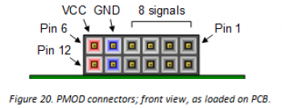

# Flashing the multizone-sdk firmware via OpenOCD

## Setup

See [Freedom E300 Arty FPGA Dev Kit Getting Started Guide](./SiFive-E310-arty-gettingstarted-v1.0.6.pdf).

**Required Hardware**:

- Olimex ARM-USB-Tiny-H jtag debug cable (+USB Type B cable)
- 10 Jumper Cables (either male-to-female, or male-to-male with extra female-to-female ribbon cable)
- micro-usb cable (USB Type micro-B)

Connect the USB interface with the micro-usb cable.

Connect the Debugger as described in the getting started guide linked above:  
_(Please ignore that due to formatting the first rows in each below table is marked as table head - it does not have a meaning and is simply the first row.)_

On the Arty Board JD PMOD Header the jumper cables should be connected as follows:



square pad  | 1 : TDO (purple)     | 7 : TDI (yellow)
------------|----------------------|----------------
.           | 2 : nTRST (orange)   | 8 : TMS (green)
.           | 3 : TCK (blue)       | 9 : nRST (grey)
.           | 4                    | 10
“GND”       | 5 : GND (black)      | 11 : GND (white)
“VCC”       | 6 : VREF (brown)     | 12 : VREF (red)

On the Olimex head the pinout depends on whether an extra ribbon cable is used or not!

- Without extra cable  
  => only with male-to-female jumpers between board and olimex head:

.     | 1 : VREF (red)     | 2 : VREF (brown)
------|--------------------|----------------
.     | 3 : nTRST (orange) | 4
.     | 5 : TDI (yellow)   | 6
.     | 7 : TMS (green)    | 8
NOTCH | 9 : TCK (blue)     | 10
NOTCH | 11                 | 12
.     | 13 : TDO (purple)  | 14 : GND (black)
.     | 15 : nRST (grey)   | 16 : GND (white)
.     | 17                 | 18
.     | 19                 | 20
.     | (LED)              |

- With extra cable  
  => ribon cable connected to Olimex head + male-to-male jumper cables  
  -> the pinout on the ribbon cable needs to be mirrored:
 (_Note that the Notch is on the **right** side here_)


2 : VREF (brown)| 1 : VREF (red)     | -
----------------|--------------------|------
4               | 3 : nTRST (orange) |
6               | 5 : TDI (yellow)   |
8               | 7 : TMS (green)    |
10              | 9 : TCK (blue)     | NOTCH
12              | 11                 | NOTCH
14 : GND (black)| 13 : TDO (purple)  |
16 : GND (white)| 15 : nRST (grey)   |
18              | 17                 |
20              | 19                 |

### Steps

#### Flash the **multizone-fpga** RISC-V core with Vivado

The multizone-fpga repository provides the RISC-V softcore implementation for the board, based on the SiFive E300 SoC. It needs to be flashed before the actual multizone-sdk firmware can be loaded.

The memory configuration (.mcs) file can either be downloaded as prebuild-bitstream from the [hex-five/multizone-fpga](https://github.com/hex-five/multizone-fpga) repository, or self-build as described in the getting started guides for [Windows](./getting-started_win.md) and [Arch](./getting-started_arch.md).
It can then be flashed with Vivado as described in <https://github.com/hex-five/multizone-fpga>:

> To program the SPI flash with Vivado:
>
> - Launch Vivado
> - Open Hardware Manager, click the auto-connect icon, and open the target board
> - Right click on the FPGA device and select ”Add Configuration Memory Device”
> - Select Part "s25fl128sxxxxxx0-spi-x1_x2_x4" ("mt25ql128-spi-x1_x2_x4" if you have an old Arty 35T)
> - Click OK to ”Do you want to program the configuration memory device now?”
> - Add X300ArtyA7-35T.mcs or X300ArtyA7-100T.mcs depending on your board
> - Select OK
> - Once the programming completes in Vivado, press the “PROG” Button on the Arty board to load the image into the FPGA


#### Load the **multizone-fpga** firmware with OpenOCD

Make sure the Olimex JTAG debugger is connect as described in [Setup](./flashing-firmware.md#setup) above.

Build the sdk firmware as described in the getting started guide for [Arch](./getting-started_arch.md#building-the-hexfivemultizone-sdk-example-application).

Flash the firmware with:

```sh
make load
```
_**Note**: In the multizone-sdk README the following notes were added:_

>Important: make sure that switch SW3 is positioned close to the edge of the board.
>
> Important: open jumper JP2 (CK RST) to prevent a system reset upon UART connection.

When we tested it however, we had to leave the JP2 jumper closed otherwise we didn't get the any output from the board via the serial terminal as described below. We did not have the issue with the system reset upon UART connection.

#### Connect via serial terminal

See instructions from [multizone-sdk README](https://github.com/hex-five/multizone-sdk#run-the-multizone-reference-application):

> Connect the UART port (ARTY micro USB J10) as indicated in the user manual.
>
> On your computer, start a serial terminal console (GtkTerm) and connect to /dev/ttyUSB1 at 115200-8-N-1
>
> Hit the enter key a few times until the cursor 'Z1 >' appears on the screen
>
> Enter 'restart' to display the splash screen
>
> Hit enter again to show the list of available commands

On Arch we used `minicom` instead of GtkTerm:

```sh
# minicom -S 
```

And then changed the serial port setup via:
```
serial port setup 
> A - Serial Device > /dev/ttyUSB1 > <enter>
> E - Bps/Par/Bits > E: 115200 > Q: 8-N-1 > <enter>
<enter>
> exit
```

```sh
=====================================================================
                     Hex Five MultiZone® Security
    Copyright© 2020 Hex Five Security, Inc. - All Rights Reserved
=====================================================================
This version of MultiZone® Security is meant for evaluation purposes
only. As such, use of this software is governed by the Evaluation
License. There may be other functional limitations as described in
the evaluation SDK documentation. The commercial version of the
software does not have these restrictions.
=====================================================================
Machine ISA   : 0x40101105 RV32 ACIMU
Vendor        : 0x0000057c Hex Five, Inc.
Architecture  : 0x00000001 X300
Implementation: 0x20181004
Hart id       : 0x0
CPU clock     : 64 MHz
RTC clock     : 16 KHz

PLIC @0x0c000000
UART @0x10013000
GPIO @0x10012000

Z1 >
```
